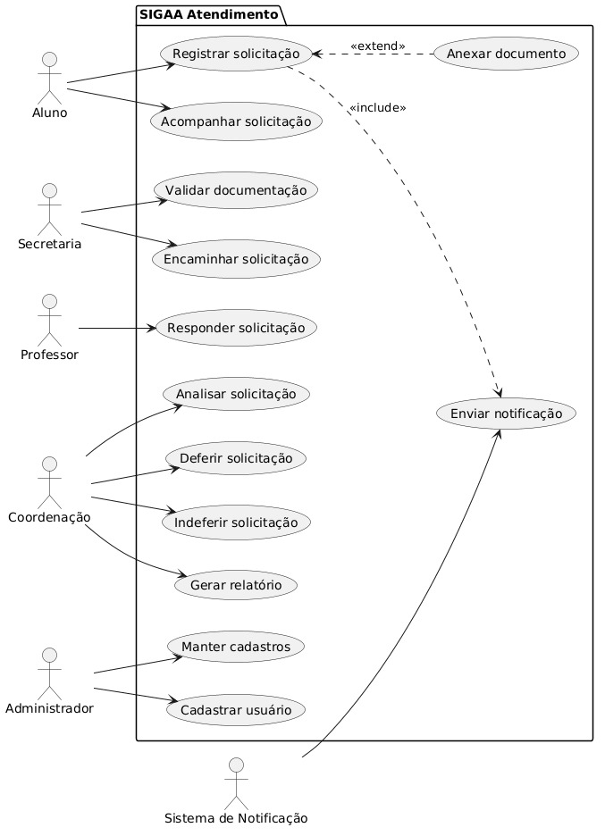
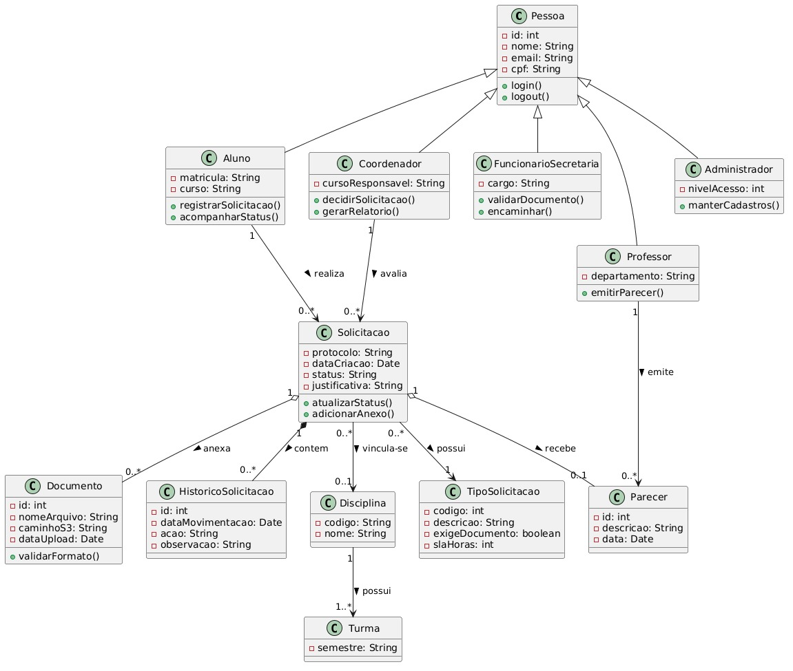
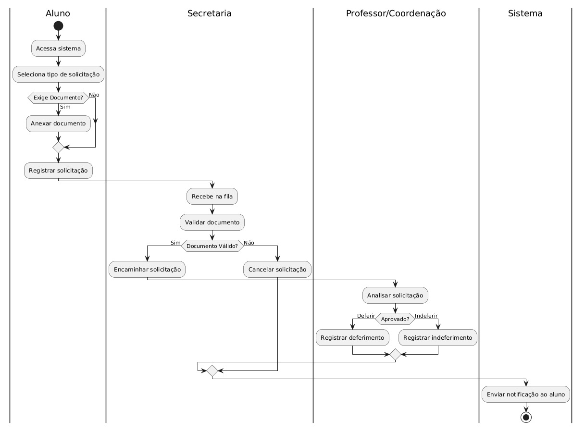
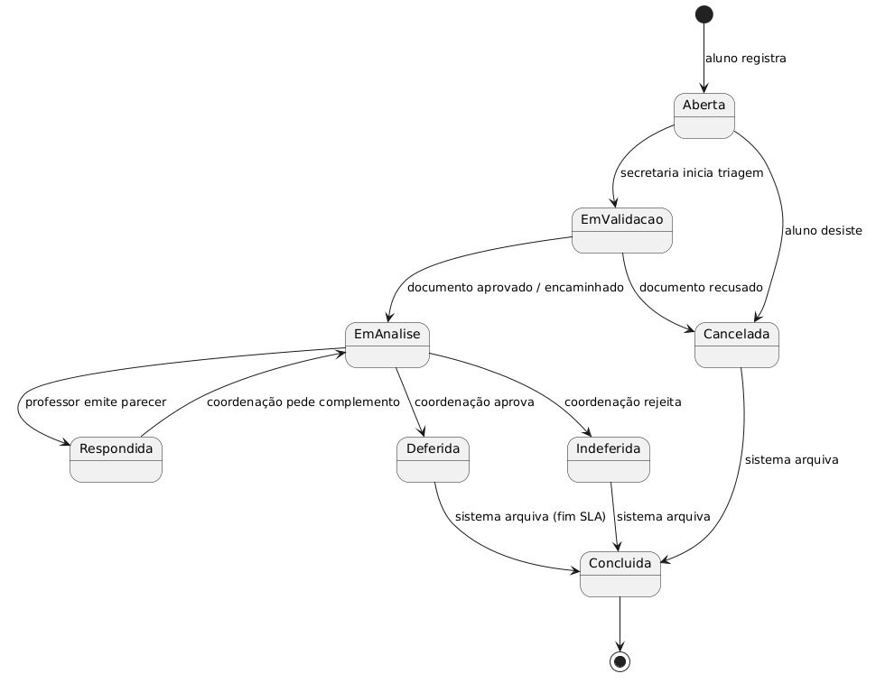
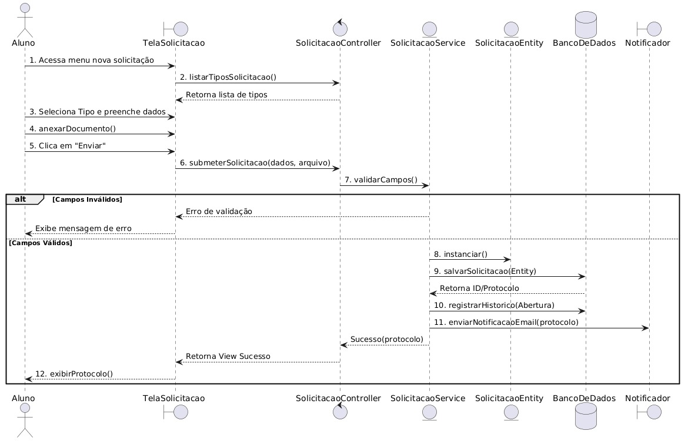
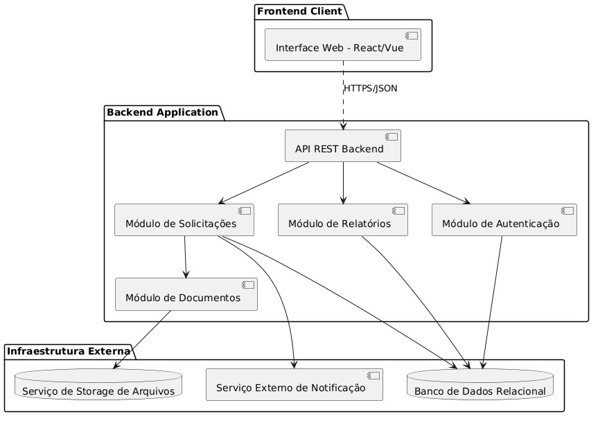
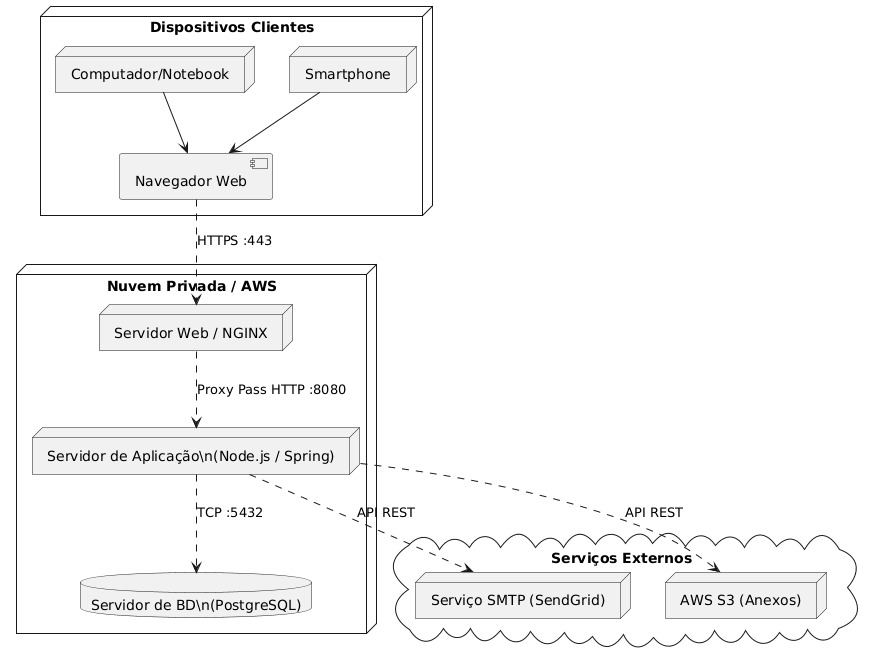

# Alunos #
* Alessandro Uchoa do Nascimento 202402217356
* Antonio Wagner Levy Lima Fernandes 202403517531
* Allison Bruno Ferreira do Nascimento 202402217372
* Leonardo Silva Lima 202402218671

# Relatório Técnico de Modelagem UML
**Sistema:** SIGAA Atendimento (Sistema de Gestão de Atendimento Acadêmico)

---

## 1. Introdução e Contextualização
### 1.1 Breve descrição do sistema
O **SIGAA Atendimento** é uma plataforma desenvolvida para centralizar e gerenciar as solicitações acadêmicas realizadas por alunos em uma instituição de ensino superior. O sistema abrange desde a abertura do requerimento pelo aluno, passando pela triagem na secretaria, análise de professores, até o deferimento ou indeferimento pela coordenação.

### 1.2 Problema que o sistema busca resolver
Atualmente, as solicitações (como segunda chamada, revisão de nota e abono de falta) ocorrem de maneira informal via WhatsApp, e-mail ou presencialmente. Isso causa perda de rastreabilidade, demora excessiva nas respostas, extravio de documentos e total ausência de indicadores para a gestão acadêmica.

### 1.3 Público-alvo
* **Alunos:** Que precisam de um canal oficial e rastreável.
* **Secretaria Acadêmica:** Que necessita organizar a triagem e validação de documentos.
* **Professores:** Que precisam emitir pareceres sobre casos específicos de suas disciplinas.
* **Coordenação:** Que precisa tomar decisões formais e acompanhar o volume de demandas.
* **Administração TI:** Que gerencia os perfis e acessos.

---

## 2. Documento de Requisitos

### 2.1 Requisitos Funcionais (RF)
| Código | Descrição |
|---|---|
| RF01 | O sistema deve permitir o cadastro de alunos. |
| RF02 | O sistema deve permitir o cadastro de professores. |
| RF03 | O sistema deve permitir o cadastro de disciplinas e turmas. |
| RF04 | O sistema deve permitir que o aluno registre uma solicitação acadêmica. |
| RF05 | O sistema deve permitir que o aluno anexe documentos à solicitação. |
| RF06 | O sistema deve permitir que o aluno acompanhe o status da solicitação. |
| RF07 | O sistema deve permitir que a secretaria valide documentos enviados. |
| RF08 | O sistema deve permitir o encaminhamento para professor ou coordenação. |
| RF09 | O sistema deve permitir que o professor responda solicitações. |
| RF10 | O sistema deve permitir que a coordenação aprove ou indefira solicitações. |
| RF11 | O sistema deve permitir o envio de notificações ao aluno. |
| RF12 | O sistema deve permitir a geração de relatórios. |
| **RF13** | **[NOVO]** O sistema deve permitir que o aluno baixe um comprovante (protocolo) em PDF. |
| **RF14** | **[NOVO]** O sistema deve manter um histórico de mensagens (chat) dentro do processo da solicitação. |
| **RF15** | **[NOVO]** O sistema deve emitir alertas automáticos para a coordenação caso uma solicitação passe do prazo de SLA. |

### 2.2 Requisitos Não Funcionais (RNF)
| Código | Descrição |
|---|---|
| RNF01 | O sistema deverá ser web e responsivo. |
| RNF02 | O sistema deverá possuir autenticação por login e senha. |
| RNF03 | O sistema deverá registrar data e hora de cada movimentação. |
| RNF04 | O sistema deverá utilizar banco de dados relacional. |
| RNF05 | O sistema deverá seguir arquitetura em camadas ou padrão MVC. |
| RNF06 | O sistema deverá permitir acesso conforme o perfil do usuário. |
| RNF07 | O tempo de resposta das operações principais não deverá ultrapassar 3 segundos. |
| RNF08 | O sistema deverá manter histórico das alterações realizadas. |
| **RNF09** | **[NOVO]** O sistema deverá garantir criptografia AES-256 para o armazenamento de documentos anexados (ex: atestados médicos). |
| **RNF10** | **[NOVO]** O sistema deverá ter uma disponibilidade mínima de 99.5% em período de provas. |

### 2.3 Regras de Negócio (RN)
| Código | Descrição |
|---|---|
| RN01 | Uma solicitação deve estar vinculada a um único aluno. |
| RN02 | Uma solicitação deve possuir obrigatoriamente um tipo de solicitação. |
| RN03 | Solicitações de segunda chamada devem conter documento comprobatório. |
| RN04 | Solicitações de revisão de nota devem estar vinculadas a uma disciplina. |
| RN05 | Uma solicitação pode ser encaminhada para professor, secretaria ou coordenação. |
| RN06 | O aluno não pode alterar uma solicitação após ela entrar em análise. |
| RN07 | A coordenação pode deferir ou indeferir uma solicitação. |
| RN08 | O professor pode emitir parecer técnico sobre solicitações acadêmicas. |
| RN09 | Toda solicitação deve possuir um status atual. |
| RN10 | Os status possíveis são: Aberta, Em Validação, Em Análise, Respondida, Deferida, Indeferida, Cancelada e Concluída. |
| **RN11** | **[NOVO]** O prazo máximo para resolução de qualquer solicitação é de 5 dias úteis. |
| **RN12** | **[NOVO]** Documentos anexados devem estar obrigatoriamente no formato PDF ou JPG e não ultrapassar 5MB. |

---

## 3. Modelo de Casos de Uso

### 3.1 Diagrama de Casos de Uso

### 3.2 Descrição Textual de Casos de Uso

#### Caso de Uso 1: Registrar Solicitação Acadêmica (Obrigatório)
* **Ator Principal:** Aluno
* **Atores Secundários:** Sistema de Notificação
* **Pré-condições:** O aluno deve estar logado no sistema e possuir matrícula ativa.
* **Fluxo Principal:**
    1. O aluno acessa o menu de "Nova Solicitação".
    2. O sistema apresenta os tipos de solicitações disponíveis.
    3. O aluno seleciona o tipo desejado (ex: Segunda Chamada).
    4. O aluno preenche os campos com a justificativa.
    5. O aluno clica em "Salvar".
    6. O sistema valida os dados obrigatórios.
    7. O sistema gera um número de protocolo com status "Aberta".
    8. O sistema registra o histórico de criação.
    9. O Sistema de Notificação envia um e-mail com o protocolo ao aluno.
    10. O sistema exibe o protocolo e a mensagem de sucesso.
* **Fluxos Alternativos:**
    * *FA01 - Tipo exige anexo:* No passo 3, se o tipo de solicitação selecionado exigir documento (ex: atestado para segunda chamada), o sistema exibe o campo de anexo (extend: Anexar documento). O aluno faz o upload, e o fluxo segue para o passo 5.
* **Fluxo de Exceção:**
    * *FE01 - Campos obrigatórios ausentes:* No passo 6, se o aluno não preencher a justificativa, o sistema exibe mensagem de erro e aborta a gravação.
    * *FE02 - Formato de arquivo inválido:* Se o aluno anexar um arquivo `.exe`, o sistema bloqueia (RN12) e solicita PDF/JPG.
* **Pós-condições:** A solicitação é salva no banco de dados e fica visível na fila da Secretaria.
* **Regras Relacionadas:** RN01, RN02, RN03, RN04, RN09, RN10, RN12.

#### Caso de Uso 2: Validar Documentação
* **Ator Principal:** Secretaria
* **Pré-condições:** Funcionário da secretaria autenticado; existir solicitação com status "Em Validação" ou "Aberta".
* **Fluxo Principal:**
    1. A secretaria acessa a fila de solicitações pendentes.
    2. Seleciona uma solicitação para avaliar.
    3. Analisa a justificativa e baixa o documento anexo para conferência.
    4. Confirma a validade do documento.
    5. O sistema altera o status para "Em Análise".
    6. A secretaria encaminha o processo para o setor responsável (Professor ou Coordenação).
    7. O sistema registra o histórico da movimentação.
* **Fluxos Alternativos:**
    * *FA01 - Documento Incompleto:* No passo 4, se o atestado for inválido, a secretaria indefere administrativamente, alterando o status para "Cancelada" e notificando o aluno.
* **Pós-condições:** Solicitação avança no fluxo ou é encerrada precocemente.
* **Regras Relacionadas:** RN05, RN09, RN10.

---

## 4. Modelo Estrutural (Classes)

### 4.1 Diagrama de Classes

### 4.2 Justificativas Técnicas Obrigatórias
1.  **Herança de Pessoa:** Optou-se por abstrair `Aluno`, `Professor`, `Coordenador`, `FuncionarioSecretaria` e `Administrador` da superclasse `Pessoa`. Isso evita duplicação de dados básicos (nome, e-mail, cpf) e centraliza a lógica de autenticação do sistema na classe pai, facilitando o cumprimento do RNF02 e RNF06.
2.  **Composição (Histórico) vs Agregação (Documento):** A relação entre `Solicitacao` e `HistoricoSolicitacao` é uma Composição (losango preenchido), pois um histórico não existe sem a solicitação atrelada a ele (se a solicitação sumir, o histórico perde sentido). Já a relação com `Documento` e `Parecer` é Agregação (losango vazio), indicando que partes anexas podem ser manipuladas de forma menos rígida estruturalmente no ciclo de vida.
3.  **Classe Parecer separada da Solicitação:** Decidiu-se extrair `Parecer` para uma classe própria em vez de ser um mero atributo de string em `Solicitacao`. Isso foi feito porque um parecer exige rastreabilidade: precisamos saber *quem* deu o parecer (associação com Professor) e a *data* em que foi emitido, garantindo integridade e auditoria.

---

## 5. Modelos Comportamentais (Atividades)

### 5.1 Diagrama de Atividades

---

## 6. Modelos Comportamentais (Estados)

### 6.1 Diagrama de Estados da classe `Solicitacao`

---

## 7. Modelo de Interação (Sequência)

### 7.1 Diagrama de Sequência

---

## 8. Arquitetura do Sistema

### 8.1 Diagrama de Componentes

### 8.2 Diagrama de Implantação

---

## 9. Conclusão
Este documento compila todas as entregas do projeto de modelagem UML para o sistema SIGAA Atendimento. Foi garantida a coerência e a consistência entre todos os artefatos, assegurando que o diagrama de classes (completamente associado) se conecta perfeitamente ao banco de dados representado na arquitetura, e que o fluxo traçado no diagrama de sequência respeita fielmente os estados estabelecidos no diagrama de máquina de estados. Com esta documentação, a equipe de engenharia dispõe de uma blueprint completa, pronta para iniciar a fase de implementação técnica.